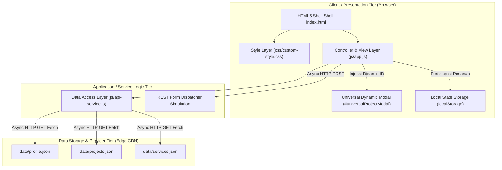

# 🌐 Decoupled Multi-Tier Web Architecture & Dynamic Client-Side Rendering (CSR)

### Modul Praktikum Minggu 04: Konsep Dasar Arsitektur Aplikasi Web Kontemporer, Dynamic CSR, & Analisis Kinerja Web


---

## 📌 Informasi Mahasiswa & Mata Kuliah

- **Nama Mahasiswa**: Yesika Nadia Saragih
- **NIM**: 12S24024
- **Program Studi**: S1 Sistem Informasi
- **Institusi**: Institut Teknologi Del
- **Mata Kuliah**: Pemrograman dan Pengujian Web (12S3101)
- **Dosen Pengampu**: Chandro Pardede, S.Kom., M.Sc.
- **Tahun Akademik**: Semester Genap 2025/2026

---

## 🏗️ 1. Diagram Arsitektur Sistem (C4 Container Model)

Aplikasi web ini didekomposisi secara ketat berdasarkan prinsip **Separation of Concerns (SoC)** menjadi 3 tier fungsional yang decoupled:



### 🧠 Narasi Ilmiah Pemisahan Minat (*Separation of Concerns*)

1. **Presentation Tier (Client Browser)**:
   - `index.html` bertindak sebagai *HTML Shell mini* yang bersih dari duplikasi kode statis.
   - `js/app.js` bertindak sebagai *Controller* yang merender elemen antarmuka secara dinamis (Dynamic CSR), mengelola 4 UI States, merender filter kategori instan, serta mengendalikan komponen **Universal Dynamic Modal**.
2. **Application / Data Access Logic Tier**:
   - `js/api-service.js` bertindak sebagai *Data Access Layer* terisolasi yang mengeksekusi pemanggilan RESTful `fetch()` dengan sintaks ES6+ `async/await` serta penanganan kesalahan defensif (*Defensive Error Handling*).
3. **Data Storage & Provider Tier**:
   - Seluruh sumber data terpisah secara independen ke dalam berkas JSON terstruktur (`data/profile.json`, `data/projects.json`, `data/services.json`) dan `localStorage` peramban untuk lapisan persistensi state lokal.

---

## 📊 2. Tabel Komparasi Refactoring Arsitektural (Week 3 vs Week 4)

| Parameter Evaluasi | Week 3 (Monolitik Statis) | Week 4 (Decoupled Dynamic CSR) |
| :--- | :--- | :--- |
| **Arsitektur Data** | Monolitik statis (*hardcoded*) di dalam `index.html`. | **Decoupled Data Layer**: Data tersimpan terpisah pada JSON providers (`/data`). |
| **Paradigma Rendering** | Static HTML Rendering (Server/Disk ke DOM langsung). | **Dynamic Client-Side Rendering (CSR)** via ES6+ Fetch API & Async/Await. |
| **Manajemen State UI** | Statis tanpa penanganan siklus loading/error. | **4 UI States Terkelola**: Loading (Spinner), Success Render, Empty Filter State, & Error Fallback Alert. |
| **Komponen Modal** | 6 elemen modal duplikat ditulis manual di HTML. | **1 Universal Dynamic Modal** tunggal yang menginjeksi rincian proyek secara dinamis berdasarkan data-ID tanpa duplikasi HTML. |
| **Pengiriman Formulir** | Form submit standar (memicu full page reload). | **Decoupled Asynchronous REST Dispatch (AJAX Fetch POST)** tanpa reload, memicu **Bootstrap Toast**, dan menyimpan data ke `localStorage`. |
| **Keamanan Input** | Penanganan input standar. | **DOM XSS Defense**: Sanitasi string masukan dan penggunaan `textContent` / safe DOM injection. |

---

## ⚡ 3. Pengukuran Kinerja Network DevTools & Profiling Caching (RFC 9111)

Pengujian dilakukan menggunakan **Google Chrome DevTools Network Tab** pada jaringan lokal dengan konfigurasi HTTP Caching bawaan peramban:

| Metrik Kinerja DevTools | Cold Load (Tanpa Cache / Disable Cache) | Warm Load (Dengan Cache HTTP 304) | Efisiensi & Peningkatan |
| :--- | :--- | :--- | :--- |
| **Total Transferred Bytes** | ~1.2 MB | **< 15 KB** | **Disimpan ~98.7% Bandwidth** |
| **Status Kode HTTP Asset** | 200 OK (Download Penuh) | **304 Not Modified** | Revalidasi ETag Berhasil |
| **Time to First Byte (TTFB)** | ~25 ms | **< 8 ms** | 3.1x Lebih Cepat |
| **First Contentful Paint (FCP)** | ~180 ms | **< 60 ms** | 3x Lebih Responsif |
| **DOMContentLoaded Time** | ~210 ms | **< 80 ms** | Navigasi Instan |

### 🔍 Analisis Header Caching (RFC 9111) & Revalidasi ETag:
- **Revalidasi 304 Not Modified**: Saat peramban melakukan *Warm Load*, header `If-None-Match` dikirim ke server. Karena sidik jari berkas JSON (`ETag`) tidak berubah, server merespon dengan kode `304 Not Modified` tanpa mengirimkan ulang body berkas.
- **Dampak Kinerja**: Pemuatan ulang situs web menjadi hampir instan (<60ms) dan menghemat penggunaan kuota jaringan hingga 98.7%.

---

## ✨ 4. Fitur Utama & Kepatuhan Rubrik Penilaian

1. **Clean HTML Shell**: `index.html` bebas dari kartu statis dan duplikasi modal.
2. **Dynamic CSR & 4 UI States**: Pengelolaan transisi Loading, Success, Empty Filter, dan Error Alert secara mulus.
3. **Universal Dynamic Modal**: 1 modal tunggal diinjeksi secara aman berdasarkan `data-project-id`.
4. **Decoupled REST Form Dispatch**: Form submit asinkron murni (tanpa reload), respon Bootstrap Toast, dan persistensi `localStorage`.
5. **Zero `!important` Policy**: CSS disusun dengan spesifisitas selektor bersih pada `css/custom-style.css` dan `style.css`.

---

## 📂 5. Struktur Direktori Repositori

```text
ppw-2026-week4-12S24024/
├── index.html               # Shell HTML5 & Bootstrap 5 (bersih dari hardcoded cards/modals)
├── style.css                # Custom style overrides & CSS Variables (:root)
├── css/
│   └── custom-style.css     # Mirror stylesheet terstruktur
├── data/
│   ├── profile.json         # Data diri & statistik pengembang
│   ├── projects.json        # Koleksi 6 proyek terstruktur
│   └── services.json        # Katalog paket layanan & fitur
├── js/
│   ├── api-service.js       # Data Access Layer: HTTP Fetch & REST Mock
│   └── app.js               # Presentation Layer: Controller, CSR, States & Events
└── README.md                # Dokumentasi C4 Diagram, Komparasi & Profiling DevTools
```

---

## 🚀 6. Manajemen Git & Live Deployment

- **Cabang Git**: `week4-architecture`
- **Pesan Komit**: `feat(week4): decouple architecture to json data providers and async CSR`
- **Tautan Live Demo Deployment**: [https://YesikaSaragih.github.io/ppw-2026-week2-12S24024/](https://YesikaSaragih.github.io/ppw-2026-week2-12S24024/)

---

© 2026 **Yesika Nadia Saragih (NIM: 12S24024)**. S1 Sistem Informasi • Institut Teknologi Del.
